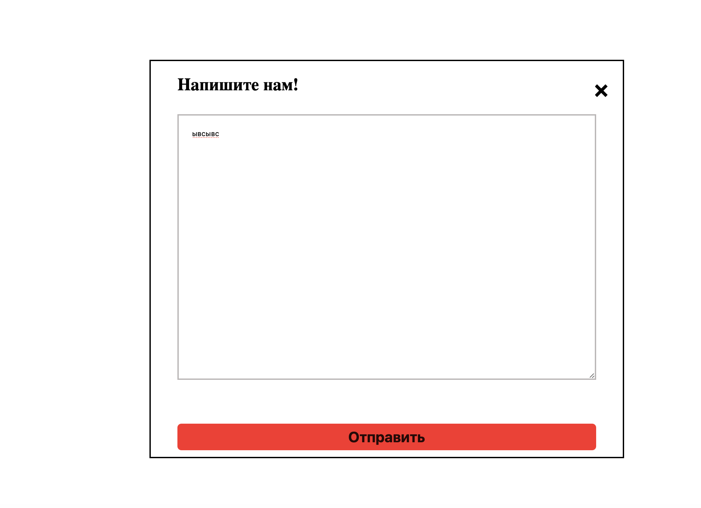

https://ilyaduzhakov.github.io/animation2_css/

# CSS Animation Project

Small CSS animation project created as part of frontend practice.  
The project demonstrates basic CSS animation techniques, element positioning and modal window behavior.

##  Technologies

- HTML
- CSS
- JavaScript
- GitHub Pages
- GitHub Actions

##  Features

- CSS animation
- Interactive popup modal
- Modal open/close behavior
- Simple JavaScript DOM interaction
- Deployed with GitHub Pages
- CI badge included

##  Screenshots

### Animated Button

### Dialog Window

